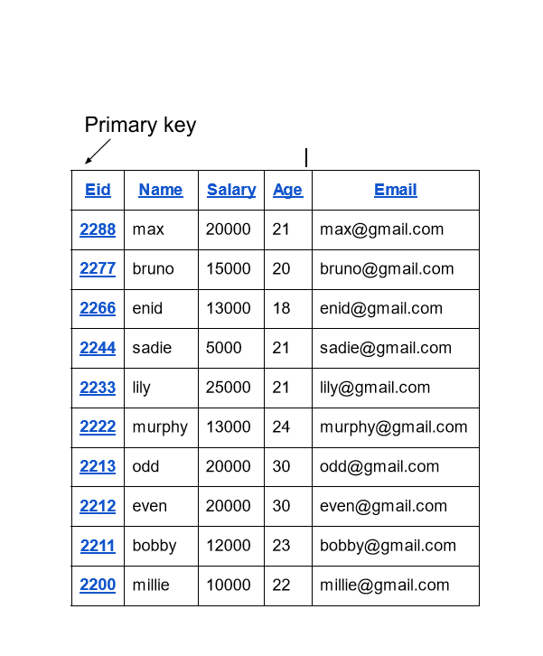
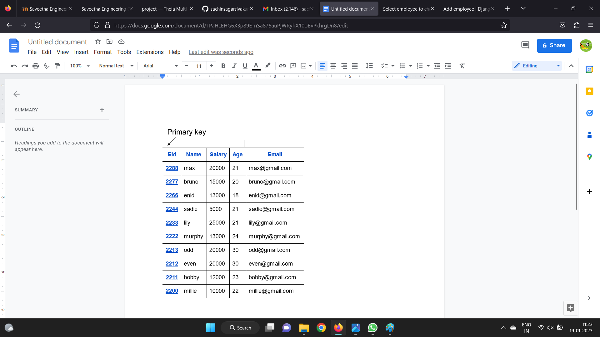

# Django ORM Web Application

## AIM
To develop a Django application to store and retrieve data from a database using Object Relational Mapping(ORM).

## Entity Relationship Diagram


## DESIGN STEPS

### STEP 1:
apply all the migrtations to the myapp
$ python3 manage.py migrate myapp 

### STEP 2:
run django admin
$ python3 manage.py runserver 0:8000

### STEP 3:
enter the following URL
http://user.student.saveetha.in:8000/admin


## PROGRAM
```
admin.py

from django.contrib import admin
from .models import Employee,EmployeeAdmin
admin.site.register(Employee,EmployeeAdmin)

models.py
from django.db import models
from django.contrib import admin
class Employee (models.Model):
    eid=models.CharField(max_length=20, primary_key=True ,help_text="Employee ID")
    name=models.CharField(max_length=100)
    salary=models.IntegerField()
    age=models.IntegerField()
    email=models.EmailField()

class EmployeeAdmin(admin.ModelAdmin):
    list_display=('eid','name','salary','age','email')    

```
## OUTPUT



## RESULT

program executed successfully